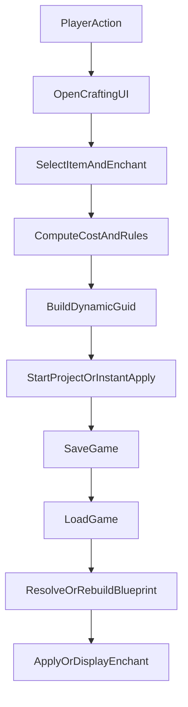

# Plan de tests complet HEAD `362a28d` → `HEAD`

## 1) Objectif et périmètre
Valider que les changements majeurs introduits depuis `362a28d` n’ont pas régressé le cœur du mod et que les nouvelles fonctionnalités (moteur d’enchantements dynamiques, nouvelles formules, UI enrichie, protections d’inventaire/craft) sont stables en conditions réelles.

Fichiers pivots à couvrir:
- Chargement/runtime: [`src/Main.cs`](src/Main.cs), [`src/CustomEnchantmentsBuilder.cs`](src/CustomEnchantmentsBuilder.cs), [`src/DynamicGuidHelper.cs`](src/DynamicGuidHelper.cs)
- Calcul/règles: [`src/CraftingCalculator.cs`](src/CraftingCalculator.cs), [`src/FormulaEvaluator.cs`](src/FormulaEvaluator.cs), [`src/EnchantmentScanner.cs`](src/EnchantmentScanner.cs)
- UX/flux joueur: [`src/CraftingUI.cs`](src/CraftingUI.cs), [`src/InventoryHandler.cs`](src/InventoryHandler.cs), [`src/CraftingCore.cs`](src/CraftingCore.cs)
- Données/config: [`ModConfig/CustomEnchants.json`](ModConfig/CustomEnchants.json), [`ModConfig/CustomEnchants.example.json`](ModConfig/CustomEnchants.example.json), [`ModConfig/Localization.json`](ModConfig/Localization.json)

## 2) Préparation des environnements de test
- Préparer 3 profils de save:
  - Save A: sans craft en cours, inventaire varié (arme/armure/bouclier/objet merveilleux).
  - Save B: crafts en cours (avec délais) et objets dans le coffre atelier.
  - Save C: save héritée (créée proche de `362a28d`) contenant anciens enchants custom si possible.
- Préparer 2 configurations mod:
  - Config standard: limites Pathfinder activées.
  - Config permissive: limites désactivées + instant crafting activé.
- Activer collecte des logs UMM/mod et noter les patterns à surveiller:
  - `[CUSTOM_ENCHANTS]`, `[DYNAMIC_ENCHANT]`, `[FORMULA]`, `[ATELIER-DEBUG]`, erreurs de désérialisation Blueprint.

## 3) Batterie de tests priorisée

### P0 — Sanity/Intégrité au démarrage
- Démarrer une nouvelle session avec `CustomEnchants.json` valide.
- Vérifier:
  - Pas de crash au `BlueprintsCache.Init`.
  - `CustomEnchantmentsBuilder.BuildAndInjectAll()` charge les modèles sans erreur fatale.
  - Changement de langue en jeu (EN/FR/RU si dispo) n’entraîne pas de perte de textes injectés.
- Critères d’acceptation:
  - UI mod accessible.
  - Aucun blocage de chargement.
  - Pas d’erreurs répétées de type binder/référence blueprint.

### P0 — Régression crafting de base
- Sur arme standard:
  - Ajouter +1, puis un enchant spécial; vérifier coût, délai, application et visibilité.
  - Upgrade d’une même famille (ex: résistance/bonus): payer uniquement le delta.
- Sur armure:
  - Refaire les mêmes scénarios pour valider facteur 1000.
- Vérifier suppression/remplacement de famille au moment de l’application (`ApplyEnchantmentsafely`).
- Critères d’acceptation:
  - Coûts cohérents avec règles et multiplicateurs.
  - Pas de doublons exacts d’enchantement.

### P0 — Sauvegarde/chargement et GUID dynamiques
- Créer plusieurs enchantements dynamiques (paramètres différents), sauvegarder puis recharger.
- Recharger plusieurs fois et changer de zone.
- Vérifier résolution via patch `BlueprintConverter.ReadJson` + reconstruction dynamique.
- Cas guid tronqué: simuler/charger une save contenant GUID partiel (si reproductible) et vérifier réparation/pad.
- Critères d’acceptation:
  - Les enchants dynamiques persistent et se reconstruisent correctement.
  - Aucun enchantement « perdu » après reload.

### P0 — Inventaire atelier et protections anti-corruption
- Déposer stack >1 dans coffre atelier: vérifier split automatique et retour du surplus.
- Tenter retrait d’objet engagé en craft:
  - Cas item normal.
  - Cas bouclier (arme cachée).
  - Cas arme double (second weapon).
- Vérifier blocage + warning UI attendu.
- Critères d’acceptation:
  - Pas de merge indésirable dans le coffre.
  - Aucun retrait possible d’un item/composant occupé.

### P1 — Moteur custom JSON (paramètres dynamiques)
- Pour 4 modèles de `CustomEnchants.example.json` (dont SaveAll virtuel):
  - Sélectionner sliders + enums + overrides localisés.
  - Vérifier nom final (BaseName/NameCompleted/Prefix/Suffix) et description.
  - Vérifier injection de champs simples (`Value`) et imbriqués (`Value.Value`).
  - Vérifier `ComponentIndex = -1` (broadcast tous composants) et index ciblé.
- Critères d’acceptation:
  - GUID généré/décodé stable pour mêmes paramètres.
  - Nom/desc cohérents avec valeurs choisies.
  - Composants effectivement modifiés.

### P1 — Formules et PriceTables
- Construire une matrice de cas pour `PointCostFormula` / `GoldOverrideFormula`:
  - Formules valides (priorité opérations, parenthèses, négatifs).
  - Variable absente/inconnue.
  - Enum standard et enum virtuel via `EnumOverrides`.
  - Fallback `DEFAULT` dans PriceTables.
- Comparer valeur UI affichée vs valeur payée/appliquée.
- Critères d’acceptation:
  - Même résultat entre prévisualisation et application réelle.
  - En cas d’erreur formule: pas de crash (retour contrôlé/log erreur).

### P1 — Règles Pathfinder et options de settings
- Scénarios avec toggles:
  - `RequirePlusOneFirst` on/off.
  - `EnforcePointsLimit` on/off + limites max enhancement/total.
  - `ApplySlotPenalty` on/off.
  - `EnableEpicCosts` on/off.
  - `InstantCrafting` on/off.
- Vérifier interactions (quand Enforce=off, les sous-options suivent le comportement attendu UI).
- Critères d’acceptation:
  - Le calcul suit exactement l’état des toggles.
  - Aucun état incohérent en revenant aux settings précédents.

### P1 — Flux UI et ergonomie
- Ouvrir atelier via:
  - Dialogue/LootUI.
  - IMGUI.
  - Hotkeys configurables depuis UMM.
- Fermer/réouvrir plusieurs fois, changer résolution/scale, filtrer/sélectionner rapidement.
- Vérifier blocage input monde pendant IMGUI (clavier/souris/gamepad).
- Critères d’acceptation:
  - Pas de soft-lock input.
  - Pas de perte de contexte item/panier entre ouvertures non destructrices.

### P2 — Compatibilité contenu externe
- Tester enchantements d’autres mods/DLC (GUID externes) présents/absents.
- Ajouter entrées JSON non utilisées et vérifier absence d’impact runtime.
- Vérifier fallback quand blueprint non trouvé.
- Critères d’acceptation:
  - Le mod reste stable même avec entrées externes imparfaites.

### P2 — Performance/stabilité longue session
- Exécuter session de 30-60 min avec crafts successifs, changements de map, sauvegardes.
- Observer:
  - Temps d’ouverture UI.
  - Temps de chargement save avec nombreux enchants dynamiques.
  - Croissance anormale de logs/erreurs.
- Critères d’acceptation:
  - Pas de dégradation visible ni accumulation d’erreurs.

## 4) Matrice de couverture minimale (à cocher)
- Types d’items: arme, armure, bouclier, objet merveilleux, arme double.
- États item: non enchanté, enchanté vanilla, enchanté custom dynamique.
- Modes craft: instantané, différé.
- États projet: aucun, en cours, terminé au chargement.
- Locales: FR + EN minimum.

## 5) Stratégie d’exécution (recommandée)
- Sprint 1 (P0): intégrité startup + craft de base + save/load dynamique + protections inventaire.
- Sprint 2 (P1): moteur JSON/formules + règles settings + UI complète.
- Sprint 3 (P2): compatibilité externe + endurance/perf.
- Après chaque sprint:
  - Reporter anomalies avec save de repro, modèle JSON concerné, logs extraits, et toggle settings actifs.

## 6) Livrables attendus de la campagne
- Rapport de validation avec:
  - Cas pass/fail par priorité.
  - Régressions confirmées vs `362a28d`.
  - Risques résiduels (notamment persistance/compat mods externes).
  - Recommandation go/no-go release.

## 7) Diagramme de flux cible à valider
